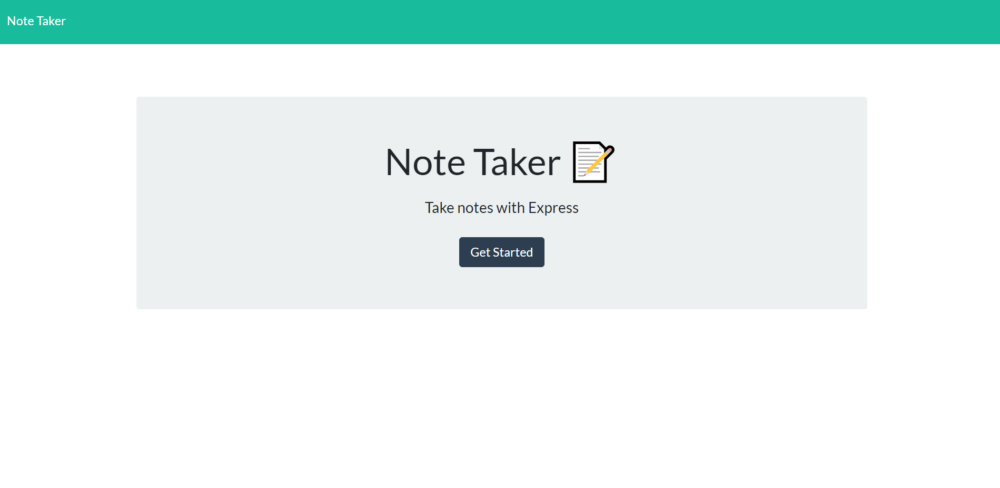

# note-taker

## Discribtion
<p>this is a note taking application that allowes user to enter, delete view notes<p>


### To run the application
```$ node app.js```

## Business Context
<p>For users that need to keep track of a lot of information, it's easy to forget or be unable to recall something important. Being able to take persistent notes allows users to have written information available when needed.</p>

## Screen Shot

